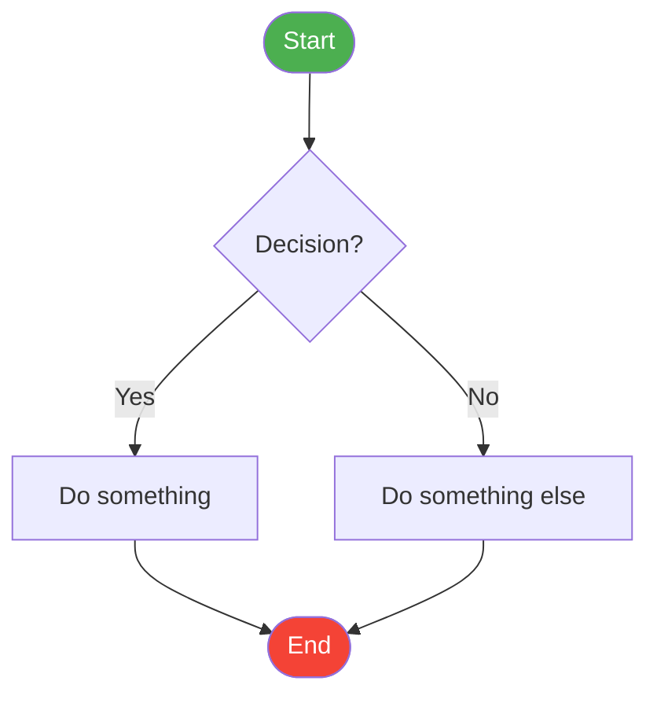
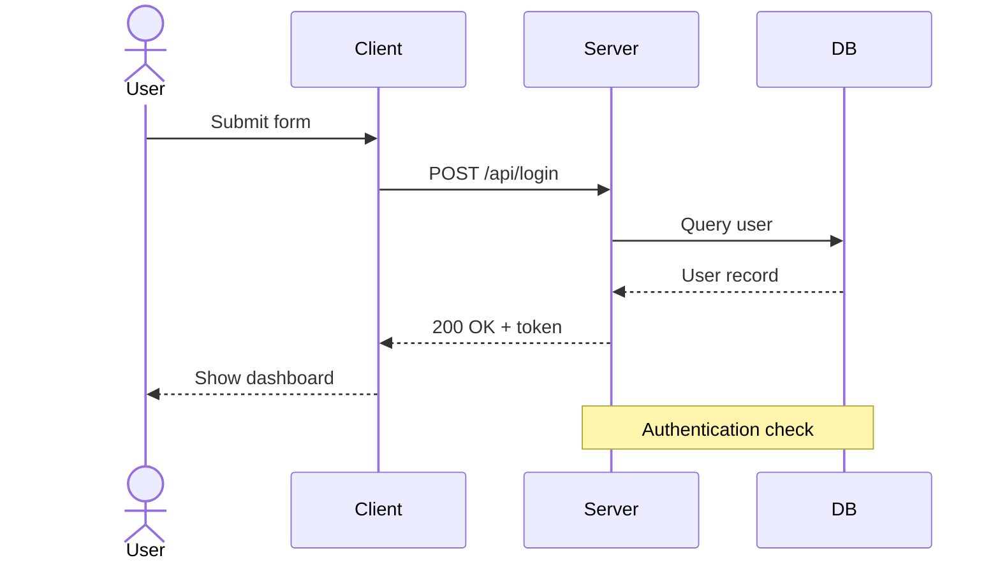
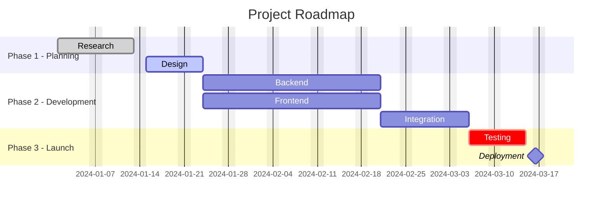
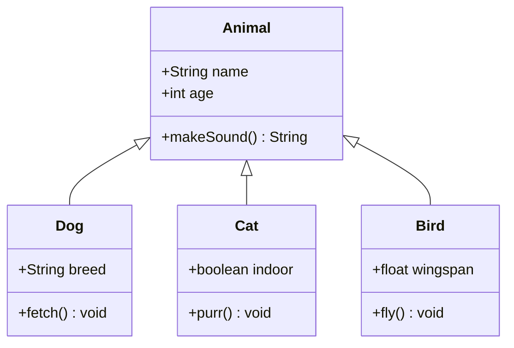
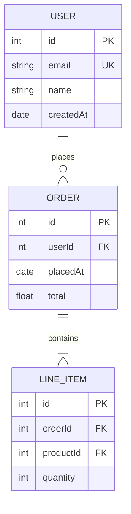
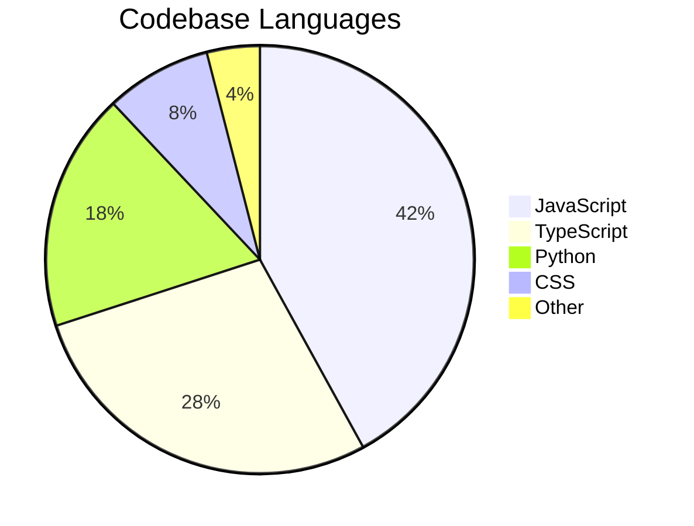
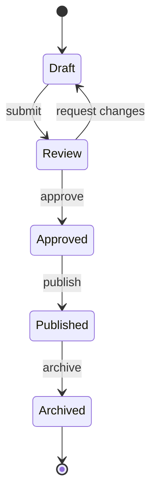
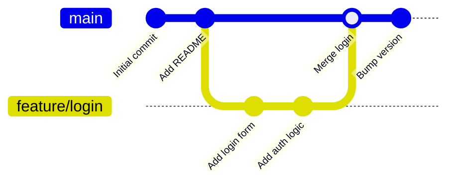

# GitHub — Complete Markdown & File Types Reference Guide

> A comprehensive reference for writing README files, Markdown documents, and understanding all file types supported on GitHub. Covers standard Markdown, GitHub Flavored Markdown (GFM), and every syntax variation.

---

## Table of Contents

1. [File Types Supported on GitHub](#1-file-types-supported-on-github)
2. [Markdown Syntax — Complete Reference](#2-markdown-syntax--complete-reference)
   - [Headings](#headings)
   - [Paragraphs & Line Breaks](#paragraphs--line-breaks)
   - [Text Formatting](#text-formatting)
   - [Blockquotes](#blockquotes)
   - [Lists](#lists)
   - [Code](#code)
   - [Horizontal Rules](#horizontal-rules)
   - [Links](#links)
   - [Images](#images)
   - [Tables](#tables)
   - [Task Lists](#task-lists)
   - [Footnotes](#footnotes)
   - [Alerts / Callouts](#alerts--callouts-github-flavored)
   - [Collapsed Sections](#collapsed-sections)
   - [Mentions & References](#mentions--references)
   - [Emoji](#emoji)
   - [HTML in Markdown](#html-in-markdown)
   - [Escaping Characters](#escaping-characters)
   - [Mathematical Expressions](#mathematical-expressions)
   - [Diagrams with Mermaid](#diagrams-with-mermaid)
3. [README Best Practices](#3-readme-best-practices)
4. [Special GitHub Markdown Files](#4-special-github-markdown-files)
5. [Quick Reference Card](#5-quick-reference-card)

---

## 1. File Types Supported on GitHub

GitHub renders, displays, or provides special support for a wide variety of file types directly in the browser. Understanding what each type does helps you organize your repo effectively.

---

### Text & Markup Files

These files are rendered or displayed with formatting in the GitHub UI.

| Extension | Type | GitHub Behavior |
|-----------|------|-----------------|
| `.md` / `.markdown` | Markdown | Fully rendered with GFM (GitHub Flavored Markdown) |
| `.txt` | Plain Text | Displayed as-is, no syntax highlighting |
| `.rst` | reStructuredText | Rendered (common in Python ecosystem) |
| `.asciidoc` / `.adoc` / `.asc` | AsciiDoc | Rendered with formatting |
| `.html` / `.htm` | HTML | Displayed as raw source code, not rendered live |
| `.xml` | XML | Displayed with syntax highlighting |
| `.csv` | CSV | Rendered as an interactive, searchable table (up to 512 KB) |
| `.tsv` | Tab-Separated Values | Rendered as an interactive table |
| `.json` | JSON | Displayed with syntax highlighting and collapsible tree view |
| `.yaml` / `.yml` | YAML | Displayed with syntax highlighting |
| `.toml` | TOML | Displayed with syntax highlighting |
| `.ini` / `.cfg` | Config files | Displayed with syntax highlighting |

> **Note:** `.html` files are shown as source code on GitHub to prevent XSS attacks. They do render on GitHub Pages.

---

### Source Code Files

GitHub provides syntax highlighting for 500+ languages via Linguist. A few important examples:

| Extension | Language |
|-----------|----------|
| `.py` | Python |
| `.js` / `.mjs` / `.cjs` | JavaScript (ESM / CommonJS) |
| `.ts` / `.tsx` | TypeScript / TypeScript + JSX |
| `.jsx` | JavaScript + JSX (React) |
| `.java` | Java |
| `.c` / `.h` | C / C header |
| `.cpp` / `.cc` / `.cxx` | C++ |
| `.cs` | C# |
| `.go` | Go |
| `.rb` | Ruby |
| `.php` | PHP |
| `.rs` | Rust |
| `.swift` | Swift |
| `.kt` / `.kts` | Kotlin / Kotlin Script |
| `.sh` / `.bash` / `.zsh` | Shell / Bash / Zsh |
| `.ps1` | PowerShell |
| `.sql` | SQL |
| `.r` / `.R` | R |
| `.lua` | Lua |
| `.ex` / `.exs` | Elixir |
| `.hs` | Haskell |
| `.scala` | Scala |
| `.dart` | Dart |
| `.vue` | Vue.js single-file component |
| `.svelte` | Svelte component |

> GitHub uses [Linguist](https://github.com/github-linguist/linguist) to detect languages. Language detection affects the repo language bar and stats.

---

### Image Files

These are rendered inline in Markdown and displayed directly in the browser.

| Extension | Notes |
|-----------|-------|
| `.png` | Lossless, supports transparency — preferred for screenshots and diagrams |
| `.jpg` / `.jpeg` | Lossy compression — preferred for photos |
| `.gif` | Supports animation — popular for demos and walkthroughs |
| `.svg` | Vector format — scalable, great for logos and diagrams. GitHub sanitizes SVGs for security. |
| `.webp` | Modern format — smaller file size than PNG/JPEG at similar quality |
| `.avif` | Next-gen format — very efficient compression |
| `.bmp` | Bitmap — rarely used, large file size |
| `.ico` | Icon files |

> **Tip:** For repo assets (logos, screenshots), store them in an `assets/` or `.github/assets/` folder to keep the root clean.

---

### Document Files

| Extension | GitHub Behavior |
|-----------|-----------------|
| `.pdf` | Rendered inline with a PDF viewer |
| `.ipynb` | Jupyter Notebooks — fully rendered with cell outputs, plots, and markdown |
| `.Rmd` | R Markdown — source code shown, not rendered |
| `.tex` | LaTeX — displayed as source code |
| `.docx` / `.xlsx` | Office files — download only, not rendered |

---

### Media Files

| Extension | Type | GitHub Behavior |
|-----------|------|-----------------|
| `.mp4` / `.webm` | Video | Not rendered in the browser; shows as download link |
| `.mov` | Video | Download only |
| `.mp3` / `.ogg` / `.flac` | Audio | Download only |
| `.wav` | Audio | Download only |

> **Tip:** For demo videos in READMEs, host them on GitHub Releases or YouTube and embed a linked thumbnail image.

---

### Configuration & DevOps Files

These files are recognized by GitHub and various tools for special behavior.

| File | Purpose |
|------|---------|
| `.gitignore` | Specifies files and patterns Git should not track |
| `.gitattributes` | Controls line endings, diff behavior, merge strategy per file type |
| `.gitmodules` | Tracks submodule URLs and paths |
| `.editorconfig` | Defines coding style (indentation, line endings) across editors |
| `Dockerfile` | Container image build instructions |
| `docker-compose.yml` | Multi-container Docker application configuration |
| `.github/workflows/*.yml` | GitHub Actions CI/CD pipeline definitions |
| `.github/dependabot.yml` | Automated dependency update configuration |
| `CODEOWNERS` | Auto-assign PR reviewers based on file paths |
| `package.json` | Node.js project manifest and dependency list |
| `package-lock.json` / `yarn.lock` | Lockfiles for reproducible installs |
| `requirements.txt` | Python dependencies (pip) |
| `pyproject.toml` | Modern Python project config (PEP 518) |
| `Gemfile` | Ruby dependencies (Bundler) |
| `go.mod` | Go module definition |
| `Cargo.toml` | Rust package manifest |
| `Makefile` | Build automation commands |
| `.env.example` | Template for required environment variables (never commit `.env`) |
| `LICENSE` | Project license — GitHub auto-detects and displays the license type |

---

### Archive Files

| Extension | GitHub Behavior |
|-----------|-----------------|
| `.zip` | Download only |
| `.tar.gz` / `.tgz` | Download only |
| `.tar.bz2` | Download only |
| `.7z` | Download only |
| `.rar` | Download only |

---

### Data & Specialized Files

| Extension | Type | GitHub Behavior |
|-----------|------|-----------------|
| `.csv` | Comma-separated values | Rendered as interactive searchable table |
| `.tsv` | Tab-separated values | Rendered as interactive table |
| `.geojson` / `.topojson` | Geographic data | Rendered on an interactive Leaflet map |
| `.stl` | 3D model | Rendered in an interactive 3D viewer |
| `.obj` | 3D model (Wavefront) | Rendered in interactive 3D viewer |
| `.glb` / `.gltf` | 3D model (modern) | Rendered in interactive 3D viewer |
| `.pbf` | Vector tile | Specialized map data |
| `.ipynb` | Jupyter Notebook | Fully rendered with outputs and visualizations |

---

## 2. Markdown Syntax — Complete Reference

GitHub uses **GitHub Flavored Markdown (GFM)**, which extends the [CommonMark](https://commonmark.org/) specification with additional features like tables, task lists, alerts, and Mermaid diagrams.

> **Key distinction:** Standard Markdown + CommonMark = the baseline. GFM = baseline + GitHub-specific extras. Features marked **(GFM)** below may not render in other Markdown environments.

---

### Headings

Use `#` symbols followed by a space. Six levels available.

```markdown
# H1 — Page or document title
## H2 — Major section
### H3 — Sub-section
#### H4 — Sub-sub-section
##### H5 — Minor heading
###### H6 — Smallest heading
```

**Alternate "setext" syntax (H1 and H2 only):**

```markdown
H1 Title
========

H2 Title
--------
```

**Rules & best practices:**
- Use only **one H1** per document — it represents the document title.
- Always put a **blank line after a heading** before body text.
- Always put a **space after the `#`** — `#Heading` is not valid in strict parsers.
- GitHub auto-generates anchor IDs for every heading (used for internal links).
- Anchor ID rules: lowercase, spaces become hyphens, special characters removed, duplicates get `-1`, `-2` suffix appended.

```markdown
## My Section         → #my-section
## Hello World!       → #hello-world
## Setup (macOS)      → #setup-macos
## Setup (Windows)    → #setup-windows-1  (if duplicate)
```

---

### Paragraphs & Line Breaks

```markdown
This is a paragraph. Even if you write it across
multiple lines in the source file, it renders as
one continuous block of text.

A blank line creates a new paragraph.

To force a line break within a paragraph,  
add two or more trailing spaces at the end of the line above.

Or use a backslash at the end of a line:\
This line will also break onto the next line.
```

> **Note:** The two-trailing-spaces method is invisible in editors — the backslash method is more readable. In most cases, use a new paragraph instead.

---

### Text Formatting

| Syntax | Result | Notes |
|--------|--------|-------|
| `**bold**` | **bold** | Preferred syntax |
| `__bold__` | **bold** | Alternative, avoid inside words |
| `*italic*` | *italic* | Preferred syntax |
| `_italic_` | *italic* | Alternative |
| `***bold italic***` | ***bold italic*** | |
| `**bold and *italic* mixed**` | **bold and *italic* mixed** | Nesting works |
| `~~strikethrough~~` | ~~strikethrough~~ | GFM only |
| `` `inline code` `` | `inline code` | Disables further Markdown parsing inside |
| `<u>underline</u>` | <u>underline</u> | HTML tag — not native Markdown |
| `<mark>highlight</mark>` | <mark>highlight</mark> | HTML tag |
| `<sub>subscript</sub>` | H<sub>2</sub>O | HTML tag |
| `<sup>superscript</sup>` | E=mc<sup>2</sup> | HTML tag |
| `<kbd>Ctrl</kbd>` | <kbd>Ctrl</kbd> | Renders as a keyboard key |

**Combining styles:**

```markdown
This is **bold and *italic* inside** the same sentence.

This is ***all bold and italic***.

This is ~~struck through **and bold**~~.
```

> **Note:** `__double underscore__` bold/italic does not work correctly **inside** a word (e.g., `un__believe__able`). Use asterisks for mid-word emphasis.

---

### Blockquotes

```markdown
> This is a single-line blockquote.

> This blockquote
> spans multiple lines in source
> but is one block in output.

> You can leave blank lines inside:
>
> This is still the same blockquote block.

> Nested blockquotes:
>
> > This is nested one level deep.
> >
> > > This is nested two levels deep.

> **Formatting works inside blockquotes.**
> You can use `code`, *italic*, **bold**, and even lists:
> - Item one
> - Item two
```

---

### Lists

#### Unordered Lists

Use `-`, `*`, or `+`. They are interchangeable but **don't mix markers** in the same list.

```markdown
- Item one
- Item two
  - Nested item (indent 2 spaces)
  - Another nested item
    - Even deeper (4 spaces total)
- Item three

* Asterisk marker also works
+ Plus marker also works
```

#### Ordered Lists

```markdown
1. First item
2. Second item
   1. Nested ordered item (indent 3 spaces)
   2. Another nested item
3. Third item

<!-- Numbers don't need to be sequential — GitHub auto-renumbers -->
1. First
1. Second
1. Third
<!-- renders as 1, 2, 3 -->

<!-- You can start a list at any number -->
5. Fifth
6. Sixth
7. Seventh
```

#### Mixed Lists

```markdown
1. Step one
   - Sub-point A
   - Sub-point B
2. Step two
   - Sub-point C
     1. Deeper ordered
     2. Also ordered
```

#### List Continuation (adding blocks to a list item)

```markdown
- This list item has a paragraph continuation.

  Indent by 4 spaces (or 2 for nested lists) to attach content to the item above.

  ```bash
  code blocks can attach to a list item too
  ```

- Next item.
```

> **Best practices:**
> - Use `1.` for all ordered list items so reordering doesn't require renumbering.
> - Don't mix `-`, `*`, and `+` within the same list.
> - Leave blank lines between list items only when items have multiple paragraphs.

---

### Code

#### Inline Code

Wrap with single backticks. Markdown is **not parsed** inside inline code.

```markdown
Run `git commit -m "message"` to save your changes.

The `**this will not be bold**` will show literally.
```

#### Fenced Code Blocks

Use triple backticks (```) or triple tildes (`~~~`), followed by an optional language identifier for syntax highlighting.

````markdown
```python
def greet(name: str) -> None:
    print(f"Hello, {name}!")

greet("GitHub")
```
````

````markdown
```javascript
const greet = (name) => {
  console.log(`Hello, ${name}!`);
};
```
````

````markdown
```bash
git add .
git commit -m "Initial commit"
git push origin main
```
````

````markdown
```diff
- removed line
+ added line
  unchanged line
```
````

````markdown
```json
{
  "name": "my-project",
  "version": "1.0.0"
}
```
````

**Common language identifiers for syntax highlighting:**

`python`, `javascript` / `js`, `typescript` / `ts`, `jsx`, `tsx`, `java`, `c`, `cpp`, `csharp` / `cs`, `go`, `rust` / `rs`, `ruby` / `rb`, `php`, `swift`, `kotlin`, `bash` / `shell` / `sh`, `powershell`, `sql`, `html`, `css`, `scss`, `json`, `yaml` / `yml`, `toml`, `xml`, `markdown` / `md`, `diff`, `plaintext` / `text`, `dockerfile`, `graphql`, `r`, `lua`, `haskell`, `elixir`, `scala`, `dart`

#### Indented Code Block (legacy — avoid)

```markdown
    Indent with 4 spaces to create a code block.
    This is harder to read and doesn't support language highlighting.
    Use fenced blocks instead.
```

#### Showing Backticks Inside Code

Use **more backticks** to wrap content that contains backticks:

````markdown
Use double backticks to show a single backtick: `` ` ``

Show inline code that has backticks: `` `code` ``

Use 4 backticks for a fence block that contains triple backticks:
```` ```language ````
````

---

### Horizontal Rules

All three produce the same visual divider — a horizontal line:

```markdown
---

***

___
```

> **Best practice:** Use `---` for consistency. Always add a blank line **above and below** the rule to avoid it being parsed as a heading underline.

---

### Links

```markdown
<!-- Basic inline link -->
[Link text](https://example.com)

<!-- Link with a hover title -->
[Link with title](https://example.com "Appears on hover")

<!-- Bare URL — auto-linked in GFM -->
https://github.com

<!-- Email — auto-linked in GFM -->
user@example.com

<!-- Prevent auto-linking with backticks -->
`https://not-a-link.com`

<!-- Reference-style links (cleaner for long documents) -->
Check out [GitHub][gh] and [Markdown][md-spec].

[gh]: https://github.com "GitHub Homepage"
[md-spec]: https://commonmark.org

<!-- Reference-style — case-insensitive, can reuse -->
[GitHub][gh] is popular. Visit [GitHub][gh] again.

<!-- Relative links — work across forks and branches -->
[See CONTRIBUTING](./CONTRIBUTING.md)
[See the source folder](./src/)
[Go up one level](../README.md)

<!-- Anchor links to headings (auto-generated IDs) -->
[Jump to Installation](#installation)
[Jump to Usage](#usage)

<!-- Link to a heading in another file -->
[Docs intro](./docs/guide.md#introduction)

<!-- Anchor ID generation rules:
  - All lowercase
  - Spaces → hyphens
  - Special characters removed (except hyphens)
  - Duplicate headings get -1, -2 ... suffix
  Examples:
    "Hello World"     → #hello-world
    "Setup (macOS)"   → #setup-macos
    "What is Git?"    → #what-is-git
-->
```

> **Best practice:** Use relative links for all internal repo links. Absolute links break when the repo is forked or renamed.

---

### Images

```markdown
<!-- Basic image -->


<!-- Local image (relative path) -->


<!-- Image with hover title -->


<!-- Reference-style image -->
![Logo][logo-ref]

[logo-ref]: ./assets/logo.svg "Project Logo"

<!-- Linked image — image that is also a clickable link -->
[](https://example.com)

<!-- Badge (linked image — common in READMEs) -->
[](./LICENSE)

<!-- Control image size with HTML (Markdown has no size syntax) -->


<!-- Center an image with HTML -->
<p align="center">
  
</p>

<!-- Side-by-side images using a table -->
| Before | After |
|--------|-------|
|  |  |

<!-- Dark/light mode images (GFM — uses HTML picture tag) -->
<picture>
  <source media="(prefers-color-scheme: dark)" srcset="./assets/logo-dark.png">
  <source media="(prefers-color-scheme: light)" srcset="./assets/logo-light.png">
  
</picture>
```

> **Best practices:**
> - Always write meaningful alt text — it helps accessibility and shows when images fail to load.
> - Store images in `assets/` or `.github/assets/` to keep the root clean.
> - Use `<picture>` with `prefers-color-scheme` for dark/light mode logo variants.

---

### Tables

```markdown
<!-- Basic table — header separator row is required -->
| Column 1 | Column 2 | Column 3 |
|----------|----------|----------|
| Cell A   | Cell B   | Cell C   |
| Cell D   | Cell E   | Cell F   |

<!-- Column alignment using colons in the separator row -->
| Left Aligned | Center Aligned | Right Aligned |
|:-------------|:--------------:|--------------:|
| Text         |      Text      |          Text |
| More text    |   More text    |     More text |
```

**Alignment syntax:**
- `:---` = left align (default)
- `:---:` = center align
- `---:` = right align

**Rules:**
- The header separator row (`|---|`) is **required** — without it, the table won't render.
- Outer pipes (`|`) at the start and end of rows are optional but **recommended** for readability.
- Cells don't need to align in source — GitHub normalizes the display.
- You **can** use inline formatting inside cells: `**bold**`, `` `code` ``, `[links](#)`, ``
- You **cannot** use line breaks, block elements, or lists inside table cells.
- Escape a literal pipe inside a cell with `\|`

```markdown
<!-- Inline formatting in cells -->
| Command | Description |
|---------|-------------|
| `git init` | Initialize a new **local** repo |
| `git clone` | Copy a [remote repo](#) |
```

---

### Task Lists

**(GFM)** — Render as interactive checkboxes in Issues, PRs, comments, and README files.

```markdown
- [x] Completed task
- [ ] Incomplete task
- [x] Another finished item
- [ ] Still pending

<!-- Nested task lists -->
- [x] Main task done
  - [x] Sub-task 1 done
  - [ ] Sub-task 2 pending
  - [ ] Sub-task 3 pending

<!-- In Issues/PRs, checked boxes are clickable to toggle -->
```

> **Note:** In README files, checkboxes render visually but are **not** interactive. In Issues and PRs, they are clickable.

---

### Footnotes

**(GFM)**

```markdown
Here is a statement with a footnote.[^1]

This claim needs a citation.[^cite]

You can use long footnotes too.[^long]

[^1]: This is the first footnote. It renders at the bottom of the page.
[^cite]: Source: GitHub Documentation, 2024.
[^long]: Footnotes can span multiple paragraphs.

    Indent continuation lines by 4 spaces to attach them to the footnote.

    They can even contain code blocks.
```

> **Note:** Footnote labels (`[^1]`, `[^cite]`) can be any alphanumeric string. The rendered order is determined by appearance in the text, not the label.

---

### Alerts / Callouts (GitHub Flavored)

**(GFM)** — Special blockquote syntax that renders as styled callout boxes. Five types:

```markdown
> [!NOTE]
> Useful supplementary information the reader should know.

> [!TIP]
> Optional advice that helps the user succeed more easily.

> [!IMPORTANT]
> Critical information the user must not miss.

> [!WARNING]
> Urgent content that needs immediate attention or could cause problems.

> [!CAUTION]
> Advises about risks, negative outcomes, or potentially dangerous actions.
```

**Multi-line alerts:**

```markdown
> [!WARNING]
> This action is **irreversible**.
>
> Make sure you have a backup before proceeding.
> Run `git stash` to save any uncommitted changes.
```

> **Note:** Alerts only render on GitHub. In other Markdown renderers they display as plain blockquotes.

---

### Collapsed Sections

Use the HTML `<details>` and `<summary>` tags — fully supported in GitHub Markdown:

```markdown
<details>
<summary>Click to expand</summary>

This content is hidden until the user clicks the triangle.

You can include any Markdown here:

- Bullet lists
- **Bold text**
- `inline code`

```python
print("even code blocks work inside details")
```

</details>
```

```markdown
<!-- Open by default -->
<details open>
<summary>This section is expanded by default</summary>

Content visible immediately on page load.

</details>
```

```markdown
<!-- Nested details -->
<details>
<summary>Outer section</summary>

<details>
<summary>Inner section</summary>

Deeply nested content.

</details>
</details>
```

> **Important:** Leave a **blank line** after the `<summary>` closing tag and before the `</details>` tag, otherwise Markdown inside won't render correctly.

---

### Mentions & References

**(GFM)** — These create clickable links to users, issues, PRs, and commits:

```markdown
<!-- Mention a GitHub user (sends a notification) -->
@username

<!-- Mention a team within an organization -->
@org-name/team-name

<!-- Reference an issue or PR in the same repo -->
#42
#123

<!-- Reference an issue or PR in another repo -->
owner/repo#42
github/docs#1234

<!-- Reference a commit by short SHA (7+ characters) -->
abc1234
abc1234def567

<!-- Reference a commit in another repo -->
owner/repo@abc1234def5678

<!-- Auto-close an issue from a commit message or PR description -->
Fixes #42
Closes #42
Resolves #42
Fix #42
Close #42
Resolve #42

<!-- Auto-close an issue in another repo -->
Fixes owner/repo#42

<!-- These keywords only trigger closing when in the DEFAULT branch -->
```

**Closing keywords:** `close`, `closes`, `closed`, `fix`, `fixes`, `fixed`, `resolve`, `resolves`, `resolved` — all case-insensitive.

---

### Emoji

**(GFM)** — Use GitHub shortcodes with colons:

```markdown
:tada:                🎉   Celebration
:rocket:              🚀   Launch / deploy
:white_check_mark:    ✅   Done / success
:x:                   ❌   Error / failure
:warning:             ⚠️   Warning
:bulb:                💡   Idea / tip
:star:                ⭐   Favorite / important
:fire:                🔥   Hot / trending
:book:                📖   Documentation
:computer:            💻   Code / tech
:hammer:              🔨   Build / tools
:bug:                 🐛   Bug
:sparkles:            ✨   New feature
:construction:        🚧   Work in progress
:lock:                🔒   Security
:key:                 🔑   Authentication
:package:             📦   Package / release
:memo:                📝   Notes / docs
:eyes:                👀   Review / watching
:pray:                🙏   Thanks
:arrows_counterclockwise: 🔄  Update / refresh
:gear:                ⚙️   Settings / config
:speech_balloon:      💬   Comment / discussion
:link:                🔗   Link
:zap:                 ⚡   Fast / performance
```

Full list: [github.com/ikatyang/emoji-cheat-sheet](https://github.com/ikatyang/emoji-cheat-sheet)

You can also paste Unicode emoji directly — they render without shortcodes.

---

### HTML in Markdown

GitHub supports a **subset** of HTML tags inside Markdown. Unsafe tags are stripped.

```markdown
<!-- Line break -->
<br>
<br />

<!-- Horizontal rule -->
<hr>

<!-- Text formatting -->
<b>Bold</b>
<i>Italic</i>
<u>Underline</u>
<s>Strikethrough</s>
<mark>Highlighted text</mark>
<small>Small text</small>

<!-- Keyboard key styling -->
Press <kbd>Ctrl</kbd> + <kbd>C</kbd> to copy.
Press <kbd>Cmd</kbd> + <kbd>⇧ Shift</kbd> + <kbd>P</kbd>

<!-- Superscript and subscript -->
H<sub>2</sub>O
E = mc<sup>2</sup>

<!-- Alignment -->
<p align="center">Centered paragraph</p>
<p align="right">Right-aligned paragraph</p>

<!-- Image with size control -->


<!-- Centered image -->
<p align="center">
  
</p>

<!-- HTML comment — not rendered in output -->
<!-- This is invisible in the rendered view -->

<!-- Div for layout grouping -->
<div align="center">

# Centered Heading

This paragraph is also centered.

</div>
```

**Allowed tags (partial list):** `a`, `b`, `i`, `u`, `s`, `em`, `strong`, `mark`, `small`, `sub`, `sup`, `kbd`, `code`, `pre`, `br`, `hr`, `p`, `div`, `span`, `h1`–`h6`, `ul`, `ol`, `li`, `table`, `thead`, `tbody`, `tr`, `th`, `td`, `img`, `details`, `summary`, `picture`, `source`

**Stripped tags (security):** `script`, `style`, `iframe`, `form`, `input`, `object`, `embed`, `link` (in head context)

> **Note:** HTML and Markdown can coexist but with one rule: **Markdown does not render inside HTML block elements.** Leave a blank line before and after HTML blocks to separate them from Markdown.

---

### Escaping Characters

Use a backslash `\` to display Markdown special characters literally:

```markdown
\*   Not italic
\**  Not bold
\#   Not a heading
\`   Not code
\[   Not a link start
\]   Not a link end
\(   Not a URL start
\)   Not a URL end
\_   Not italic/bold
\\   Literal backslash
\!   Not an image
\|   Literal pipe (useful inside tables)
\.   Literal period
\-   Literal dash (avoids unintended list)
\+   Literal plus
\=   Literal equals (avoids setext heading)
\>   Literal greater-than (avoids blockquote)
\{   Literal brace
\}   Literal brace
```

**Alternatively**, wrap content in backticks to suppress all Markdown parsing:

```markdown
The `**text**` between backticks will not be bolded.
```

---

### Mathematical Expressions

**(GFM)** — GitHub supports LaTeX math rendered via MathJax. Enabled in `.md` files and wikis.

```markdown
<!-- Inline math — wrap with single dollar signs -->
The equation is $E = mc^2$ where $c$ is the speed of light.

Area of a circle: $A = \pi r^2$

<!-- Block math — wrap with double dollar signs, on its own line -->
$$
\int_{-\infty}^{\infty} e^{-x^2} \, dx = \sqrt{\pi}
$$

$$
\frac{-b \pm \sqrt{b^2 - 4ac}}{2a}
$$

<!-- Common LaTeX syntax quick reference -->
$\frac{a}{b}$               fraction
$\sqrt{x}$                  square root
$\sqrt[3]{x}$               cube root
$x^{2}$                     exponent / superscript
$x_{i}$                     subscript
$\sum_{i=1}^{n} i$          summation
$\prod_{i=1}^{n} x_i$       product
$\int_{a}^{b} f(x) \, dx$   integral
$\lim_{x \to \infty} f(x)$  limit
$\vec{v} = (x, y, z)$       vector
$\hat{u}$                   unit vector
$\begin{matrix} a & b \\ c & d \end{matrix}$   matrix
$\begin{pmatrix} a & b \\ c & d \end{pmatrix}$ matrix with parens

<!-- Greek letters -->
$\alpha, \beta, \gamma, \delta, \epsilon$
$\pi, \sigma, \theta, \lambda, \mu$
$\Sigma, \Delta, \Omega, \Phi, \Psi$

<!-- Logic / set notation -->
$\in, \notin, \subset, \cup, \cap, \forall, \exists, \neg$
```

> **Note:** Math rendering requires the feature to be enabled. It works in README files, issues, and PR descriptions on GitHub.com. It may not render in GitHub Enterprise or other Markdown renderers.

---

### Diagrams with Mermaid

**(GFM)** — GitHub renders Mermaid diagrams natively inside fenced code blocks tagged `mermaid`.

#### Flowchart

````markdown

````

**Node shapes:**
- `[Text]` — rectangle
- `(Text)` — rounded rectangle
- `([Text])` — stadium / pill
- `{Text}` — diamond (decision)
- `((Text))` — circle
- `>Text]` — asymmetric
- `[[Text]]` — subroutine

#### Sequence Diagram

````markdown

````

#### Gantt Chart

````markdown

````

#### Class Diagram

````markdown

````

#### Entity Relationship Diagram

````markdown

````

#### Pie Chart

````markdown

````

#### State Diagram

````markdown

````

#### Git Graph

````markdown

````

---

## 3. README Best Practices

A great README answers three questions clearly: **What is this? How do I use it? How do I contribute?**

---

### Recommended Structure

```
# Project Name
[Badges row]
[Short, punchy description — one or two sentences]
[Optional: screenshot or demo GIF]

## Features
## Prerequisites
## Installation
## Usage
## Configuration
## Project Structure
## Contributing
## Running Tests
## License
## Acknowledgements
```

Not every section is required for every project. A small utility only needs: description, installation, usage, and license.

---

### Badges

Badges provide quick visual status at a glance. Place them immediately after the project title.

```markdown
<!-- GitHub-native badges -->


<!-- CI / Build badges -->


<!-- Package badges -->


<!-- Custom badge -->

<!-- Examples: -->


```

Generate custom badges at [shields.io](https://shields.io). Use consistent badge styles (`flat`, `flat-square`, or `for-the-badge`) across a README.

---

### Rules & Best Practices

**Filename & discovery:**
- Name it `README.md` (uppercase) — GitHub renders it automatically on the repo homepage.
- GitHub also renders README files inside subdirectories and inside `.github/`.
- Supported names: `README.md`, `readme.md`, `README`, `README.txt`.

**Structure:**
- Use **one H1 only** — the project title.
- Keep the description **above the fold** (visible without scrolling).
- Use a **demo image or GIF** near the top — a picture is worth a thousand words.
- Use relative paths (`./docs/guide.md`) for internal links so they work on any branch or fork.

**Writing:**
- Short sentences. Active voice. Imperative mood for instructions ("Run `npm install`", not "You should run `npm install`").
- Show code examples — real, copy-pasteable, runnable ones.
- Always add meaningful alt text to images for accessibility.
- Keep it updated — outdated docs are worse than no docs.

**Technical:**
- Add a `## License` section with the SPDX license identifier and a link to the `LICENSE` file.
- List prerequisites explicitly — don't assume what the reader has installed.
- Show the minimum working example as early as possible.

---

## 4. Special GitHub Markdown Files

GitHub recognizes these files by name and gives them special behavior in the UI.

| File | Location | Purpose & GitHub Behavior |
|------|----------|-----------------------------|
| `README.md` | Root, `/docs`, or `/.github` | Rendered automatically on the repo, folder, or org homepage |
| `CONTRIBUTING.md` | Root or `/.github` | Linked automatically when a user opens an issue or PR |
| `CODE_OF_CONDUCT.md` | Root or `/.github` | Linked in the community standards profile checklist |
| `LICENSE` / `LICENSE.md` | Root | GitHub detects the license type and displays it in the sidebar |
| `CHANGELOG.md` | Root | Community convention for documenting version history |
| `SECURITY.md` | Root or `/.github` | Shown in the Security tab; describes how to report vulnerabilities |
| `SUPPORT.md` | Root or `/.github` | Linked when users open issues; directs them to support channels |
| `CITATION.cff` | Root | Defines how to cite the project academically; shown in GitHub sidebar |
| `FUNDING.yml` | `/.github` | Adds a "Sponsor" button to the repo with configured payment links |
| `.github/ISSUE_TEMPLATE/*.md` | `/.github/ISSUE_TEMPLATE/` | Templates shown when opening a new issue |
| `.github/ISSUE_TEMPLATE/config.yml` | `/.github/ISSUE_TEMPLATE/` | Configures the issue template chooser; can disable blank issues |
| `.github/PULL_REQUEST_TEMPLATE.md` | `/.github/` | Pre-fills the PR description box for all new pull requests |
| `.github/CODEOWNERS` | `/.github/`, root, or `/docs` | Auto-requests review from owners when matched files are changed |
| `.github/dependabot.yml` | `/.github/` | Configures automated dependency update PRs |
| `.github/workflows/*.yml` | `/.github/workflows/` | GitHub Actions CI/CD workflow definitions |
| `docs/` | Root | Convention for documentation; used as GitHub Pages source |

---

## 5. Quick Reference Card

| Element | Syntax | Notes |
|---------|--------|-------|
| H1 | `# Title` | One per document |
| H2–H6 | `## ` to `######` | Space after `#` required |
| Bold | `**text**` | |
| Italic | `*text*` | |
| Bold italic | `***text***` | |
| Strikethrough | `~~text~~` | GFM only |
| Inline code | `` `code` `` | |
| Code block | ` ```lang ` | Specify language |
| Link | `[text](url)` | |
| Link with title | `[text](url "title")` | |
| Image | `` | |
| Linked image | `[](url)` | |
| Blockquote | `> text` | |
| Nested blockquote | `>> text` | |
| Unordered list | `- item` | Also `*` or `+` |
| Ordered list | `1. item` | Auto-numbers |
| Nested list | indent 2 spaces | |
| Task list | `- [ ] task` / `- [x] done` | GFM only |
| Table | `\| col \| col \|` | Header separator required |
| Left align | `\|:---\|` | |
| Center align | `\|:---:\|` | |
| Right align | `\|---:\|` | |
| Horizontal rule | `---` | Blank lines above/below |
| Footnote | `[^1]` / `[^1]: text` | GFM only |
| Alert NOTE | `> [!NOTE]` | GFM only |
| Alert TIP | `> [!TIP]` | GFM only |
| Alert IMPORTANT | `> [!IMPORTANT]` | GFM only |
| Alert WARNING | `> [!WARNING]` | GFM only |
| Alert CAUTION | `> [!CAUTION]` | GFM only |
| Collapsed section | `<details><summary>` | HTML tag |
| User mention | `@username` | GFM only |
| Issue reference | `#42` | GFM only |
| Auto-close issue | `Fixes #42` | GFM only |
| Inline math | `$expression$` | GFM only |
| Block math | `$$expression$$` | GFM only |
| Mermaid diagram | ` ```mermaid ` | GFM only |
| Emoji | `:rocket:` | GFM only |
| Escape character | `\*` | Backslash prefix |
| HTML comment | `<!-- comment -->` | Not rendered |
| Keyboard key | `<kbd>Ctrl</kbd>` | HTML tag |
| Underline | `<u>text</u>` | HTML tag |
| Superscript | `<sup>text</sup>` | HTML tag |
| Subscript | `<sub>text</sub>` | HTML tag |
| Center align | `<p align="center">` | HTML tag |
| Dark/light image | `<picture>` + `<source>` | HTML tag |

---

*This guide covers GitHub Flavored Markdown (GFM) as of 2024. Features marked **GFM only** are GitHub-specific and may not render in other Markdown environments such as VS Code preview, Notion, or Obsidian.*
