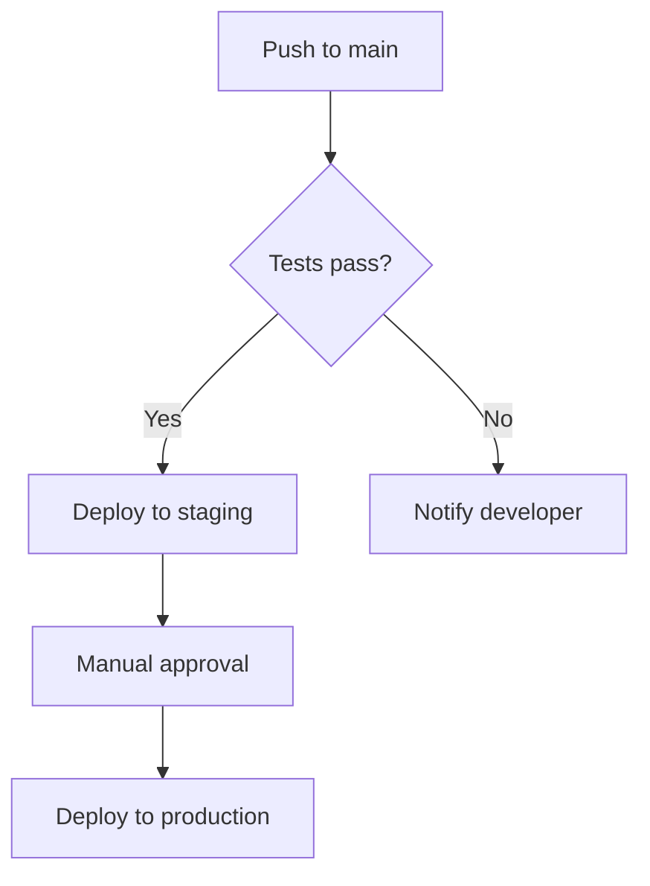

# Markdown Example

GitHub renders this as **formatted HTML** — not raw text.

## Text Formatting

You can write **bold**, *italic*, ~~strikethrough~~, and `inline code`.

> Blockquotes look like this — useful for callouts or quoting issues.

## Lists

Unordered:
- Item one
- Item two
  - Nested item
  - Another nested

Ordered:
1. First step
2. Second step
3. Third step

Task list (GitHub-specific):
- [x] Write the README
- [x] Add example files
- [ ] Push to GitHub
- [ ] Add CI workflow

## Code Blocks

```python
def greet(name: str) -> str:
    return f"Hello, {name}!"

print(greet("GitHub"))
```

```bash
git clone https://github.com/user/repo
cd repo && npm install
```

## Table

| Language | Paradigm | Typing | Year |
|----------|----------|--------|------|
| Python | Multi-paradigm | Dynamic | 1991 |
| Rust | Systems | Static | 2010 |
| TypeScript | OOP + Functional | Static | 2012 |
| Go | Concurrent | Static | 2009 |

## Mermaid Diagram



## Links & Images

[GitHub Docs](https://docs.github.com) | [Markdown Spec](https://spec.commonmark.org/)

## Footnotes

GitHub supports footnotes[^1] in Markdown.

[^1]: This is the footnote content — it renders at the bottom of the page.
